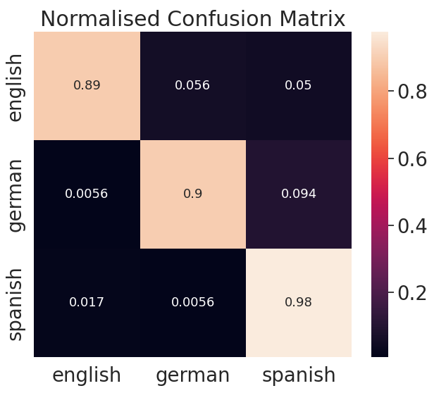

Machine learning model to detect the language of speach

dataset used for testing: https://www.kaggle.com/datasets/toponowicz/spoken-language-identification/codekac

This is little more then a bunch of tests, and borrows heavily from the work of Ilya Keznov: https://github.com/IliaZenkov/sklearn-audio-classification/blob/master/sklearn_audio_classification.ipynb

## Results from testing

# Classic Models

Classical model's accuracy when training data is unscaled:

- KNeighborsClassifier: 46.85%
- DescisionTreeClassifier: 54.07%
- RandomForestClassifier: 73%-75%
- AdaBoostClassifier: 51.67%
- GaussianNB: 37.22%
- QuadraticDiscriminantAnalysis: 49.26%

Classical model's accuracy when training data is scaled:

- KNeighborsClassifier: 53.70%
- DescisionTreeClassifier: 61.11%
- RandomForestClassifier: 35%-47%
- AdaBoostClassifier: 31.67%
- GaussianNB: 33.52%
- QuadraticDiscriminantAnalysis: 50%

# Multi Level Perception Models

Default MLP model's accuracy when training data is unscaled

- Unscaled MLP model's accuracy on training set is 98.86%
- Unscaled MLP model's accuracy on validation set is 98.17%
- Unscaled MLP model's accuracy on test set is 58.33%

Default MLP model's accuracy when training data is scaled: (THIS RANDOM RESULT CONTINUED FOR ALL SCALED MLP TESTS)

- Scaled MLP model's accuracy on training set is 33.33%
- Scaled MLP model's accuracy on validation set is 33.34%
- Scaled MLP model's accuracy on test set is 33.33%

Tuned MLP model's accuracy when training data is unscaled:

- Unscaled Tuned MLP model's accuracy on training set is 100%
- Unscaled Tuned MLP model's accuracy on validation set is 99.81%
- Unscaled Tuned MLP model's accuracy on test set is 77.40%

Tuned alpha to 3:

- Unscaled Augmented MLP model's accuracy on training set is 92.26%
- Unscaled Augmented MLP model's accuracy on validation set is 91.84%
- Unscaled Augmented MLP model's accuracy on test set is 86.48%

Tuned alpha to 5 and hidden layer nodes to 100:

- Unscaled Augmented MLP model's accuracy on training set is 86.99%
- Unscaled Augmented MLP model's accuracy on validation set is 86.43%
- Unscaled Augmented MLP model's accuracy on test set is 92.40%

# Confusion Matrices

Best MLP model's results (alpha 5 and 1 hidden layer with 100 nodes)

MLP Tuned Confusion Matrix (better overall accuracy)

Random Forest Classifier Confusion Matrix (better English Recognition)

